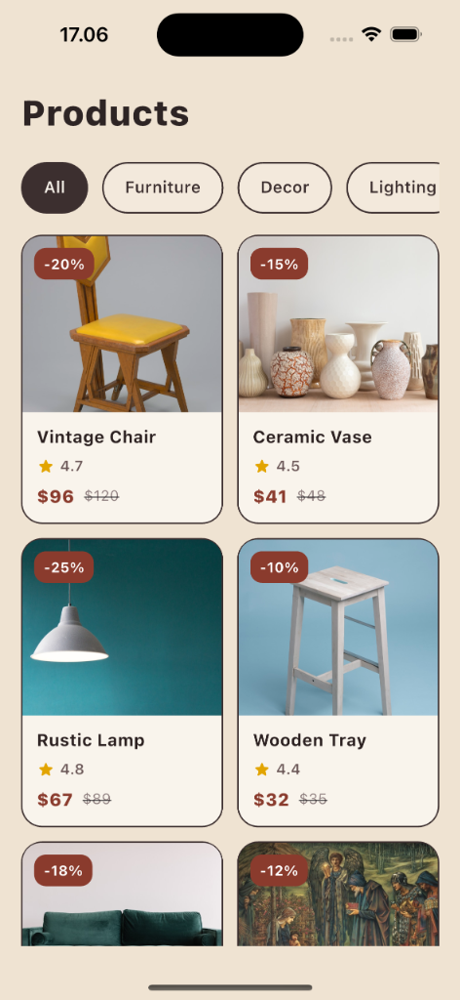
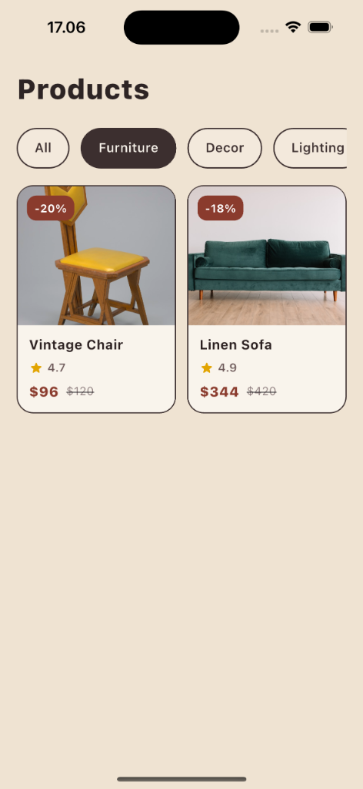
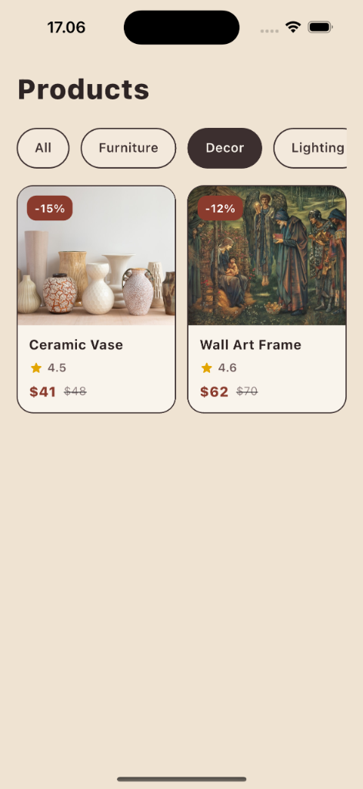
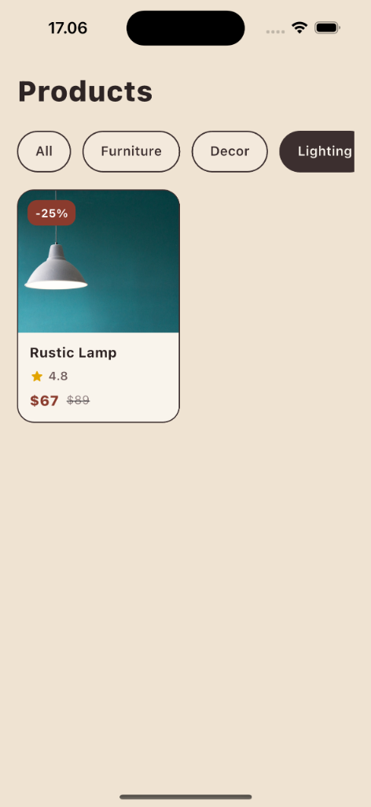
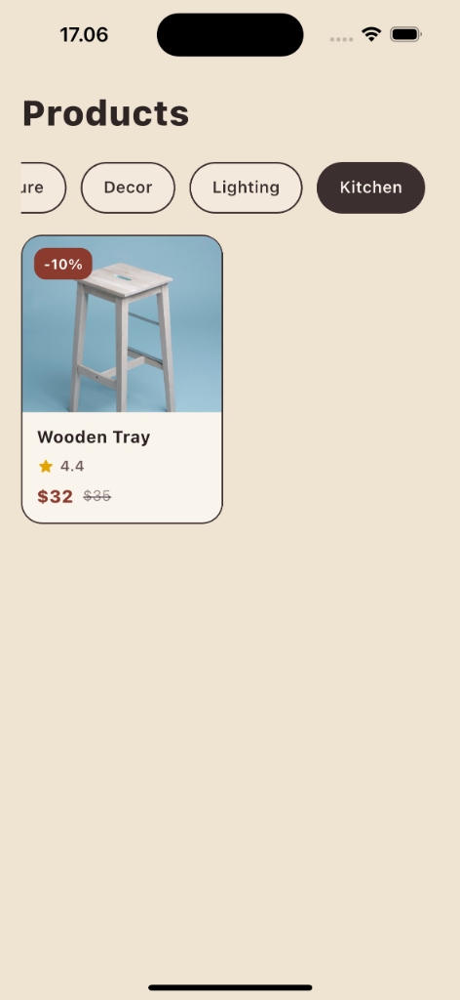

# 🏺 Vintage Catalog — Flutter Fundamental UI

[](#)
[](#)
[](#)
[](#)

Implementasi antarmuka katalog produk Flutter dengan pendekatan desain yang bersih, modular, serta mengusung palet warna hangat bertema **Vintage Wabi-Sabi**. Aplikasi ini dirancang menggunakan arsitektur widget fundamental untuk memberikan performa optimal dan responsivitas tinggi pada perangkat Web, iOS, maupun Android.

---

## 📸 App Showcase

<p align="center">
  
</p>

<p align="center">
  <b>Category Filtering States</b>
</p>

<table align="center" border="0" cellspacing="10" cellpadding="0">
  <tr>
    <td align="center" valign="top">
      <br/>
      <sub><b>Furniture State</b></sub>
    </td>
    <td align="center" valign="top">
      <br/>
      <sub><b>Decor State</b></sub>
    </td>
    <td align="center" valign="top">
      <br/>
      <sub><b>Lighting State</b></sub>
    </td>
    <td align="center" valign="top">
      <br/>
      <sub><b>Kitchen State</b></sub>
    </td>
  </tr>
</table>

---

## ✨ Fitur Utama & Desain

- **Vintage Wabi-Sabi Aesthetics**: Desain visual menggunakan palet warna earthy, natural, dengan latar belakang hangat (`#EFE3D2`) yang dipadukan dengan tipografi bersih ('Roboto') serta elemen ber-border tegas untuk kesan *clean-vintage*.
- **Responsive Adaptive Layout**: Tata letak grid produk yang responsif secara otomatis menyesuaikan jumlah kolom berdasarkan lebar layar (2 kolom pada mobile, 3 kolom pada tablet, dan 4 kolom pada desktop/web).
- **Smooth Category Filter**: Transisi kategori produk secara horizontal menggunakan *gestures* interaktif untuk memperbarui data katalog secara instan.
- **Component-Driven Architecture**: Widget reusable seperti `ProductCard` dan `CategoryItem` dipisahkan agar kode tetap modular, bersih, dan mudah dirawat.
- **Zero-Placeholder Asset Management**: Seluruh produk menggunakan aset gambar NetworkImage yang terkurasi dan relevan secara kontekstual.

---

## 🛠️ Analisis Struktur Layout & Widget

Aplikasi ini dibangun menggunakan arsitektur widget fundamental Flutter sebagai berikut:

1. **`Column`** (Struktur Vertikal Utama):
   - Menyusun elemen halaman katalog secara vertikal: Judul halaman (`Products`), kategori horizontal, dan area grid produk.
   - Digunakan di `ProductCard` untuk menyusun foto produk, nama produk, rating, serta informasi harga diskon.
2. **`Row`** (Struktur Horizontal):
   - Dipakai di dalam `ProductCard` untuk merapikan rating bintang beserta angka rating.
   - Digunakan untuk menyejajarkan harga diskon (dengan penekanan warna) di sebelah harga asli yang diberi coretan garis (*line-through*).
3. **`ListView`** (Scrollable Container):
   - **Horizontal (`ListView.builder`)**: Untuk menyusun menu filter kategori di bagian atas agar bisa digeser secara horizontal dengan performa efisien.
   - **Vertikal (`ListView`)**: Digunakan sebagai wadah utama scroll halaman untuk mencegah terjadinya *overflow* layar pada perangkat dengan layar kecil.
4. **`GridView.builder`** (Product Grid):
   - Ditempatkan di dalam `ListView` vertikal dengan konfigurasi `NeverScrollableScrollPhysics` dan `shrinkWrap: true` agar pergerakan scroll tetap dikendalikan sepenuhnya secara halus oleh parent `ListView`.
5. **`Image (NetworkImage)`**:
   - Memuat aset gambar produk langsung dari URL eksternal secara dinamis dengan rasio aspek dan pemotongan gambar (`BoxFit.cover`) yang rapi.

---

## 📂 Struktur Direktori Proyek

```text
lib/
├── models/
│   └── product_model.dart              # Model data untuk Category dan Product
├── widgets/
│   ├── category_item.dart              # Komponen button kategori horizontal
│   └── product_card.dart               # Komponen card item produk
├── screens/
│   └── product_catalog_screen.dart     # Halaman utama katalog produk
├── main.dart                           # Entry point utama (Versi Modular)
└── main_single_file.dart               # Implementasi lengkap dalam satu file (Opsional)
```

---

## 🚀 Cara Menjalankan Aplikasi

Pastikan SDK Flutter telah terinstal di komputer Anda.

### 1. Dapatkan Dependensi Proyek
```bash
flutter pub get
```

### 2. Jalankan Aplikasi

- **Menjalankan di Google Chrome (Web):**
  ```bash
  flutter run -d chrome
  ```

- **Menjalankan di iOS Simulator:**
  ```bash
  flutter run -d ios
  ```

- **Menjalankan di Android Emulator:**
  ```bash
  flutter run -d android
  ```

---

## ⚙️ Opsi Single File (Untuk Kebutuhan Pengumpulan Cepat)

Jika Anda ingin menjalankan atau mengumpulkan kode dalam bentuk berkas tunggal (*single file*):
1. Ubah nama berkas `lib/main.dart` menjadi `lib/main_modular.dart`.
2. Ubah nama berkas `lib/main_single_file.dart` menjadi `lib/main.dart`.
3. Jalankan kembali aplikasi menggunakan `flutter run`.

---

## 📜 Lisensi
Proyek ini dilisensikan di bawah **MIT License**.
